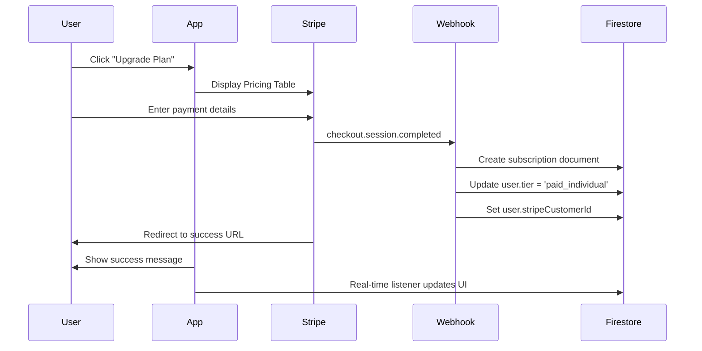
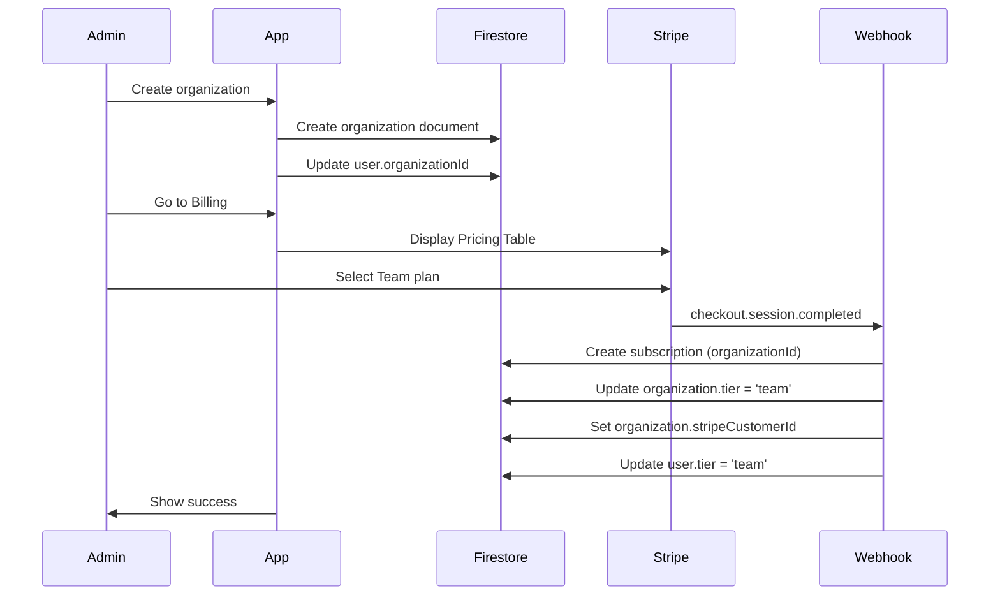
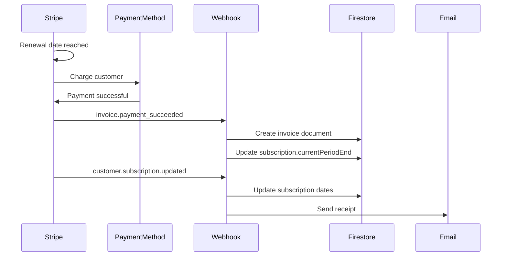
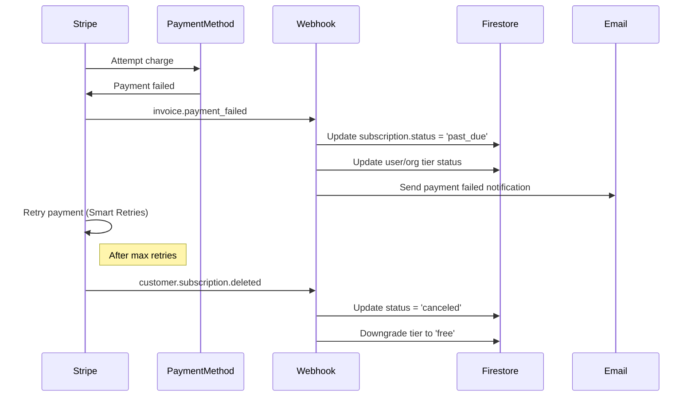
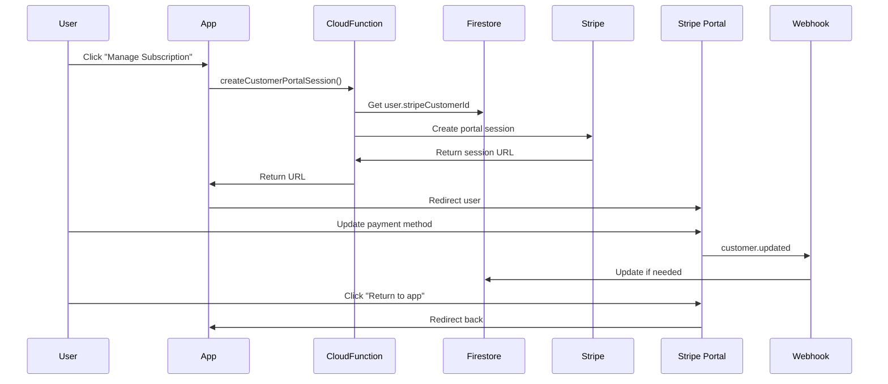
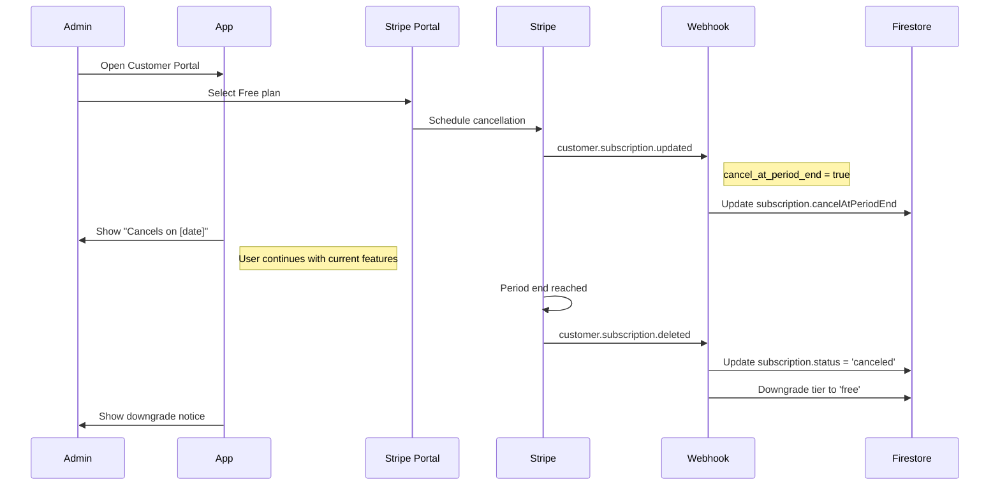

# Stripe Integration - Full Lifecycle Plan

**Version:** 1.0  
**Last Updated:** October 16, 2025  
**Purpose:** Complete Stripe payment processing, subscription management, and billing integration for AICoder.Guru

---

## 🎯 Overview

This plan covers the full lifecycle of Stripe integration including:
- Payment processing
- Subscription management (create, upgrade, downgrade, cancel)
- Webhook handling for all Stripe events
- Customer portal integration
- Billing history and invoice management
- Multi-tenant subscription handling
- Embedded checkout flows in the app

---

## 📊 Current State

### Website
- ✅ Stripe Pricing Table embedded on `/pricing` page
- ✅ Publishable Key: `pk_live_51SIW2HL6TuXGPgHweNfizoiPnr9B71LQT6NW6DW2kvBRrNCaQId6c446qbsgNUt6kN0ayeDzwyjmH4Z4D66H7gCS00gW8CnEv1`
- ✅ Pricing Table ID: `prctbl_1SIXDRL6TuXGPgHwofLggk70`

### App
- ✅ BillingPage exists but not functional
- ✅ User/Organization tier tracking in Firestore
- ✅ Subscription schema defined in `shared/src/types/billing.ts`
- ❌ No Stripe integration
- ❌ No webhook handling
- ❌ No customer portal link
- ❌ No embedded pricing table

---

## 🏗️ Architecture

### Data Model

```typescript
// Firestore Collections

// users/{userId}
{
  id: string
  email: string
  displayName: string
  tier: 'free_individual' | 'paid_individual' | 'team' | 'enterprise'
  currentRole: 'individual' | 'admin' | 'team_manager' | 'member'
  organizationId: string | null
  stripeCustomerId?: string  // NEW - for individual subscriptions
  createdAt: Timestamp
  updatedAt: Timestamp
}

// organizations/{orgId}
{
  id: string
  name: string
  tier: 'free' | 'team' | 'enterprise'
  ownerId: string
  stripeCustomerId?: string  // NEW
  maxMembers: number
  createdAt: Timestamp
  updatedAt: Timestamp
}

// subscriptions/{subscriptionId}  // NEW COLLECTION
{
  id: string  // Firestore doc ID
  stripeSubscriptionId: string  // Stripe subscription ID
  stripeCustomerId: string
  organizationId?: string  // For team/enterprise
  userId?: string  // For individual paid plans
  tier: 'paid_individual' | 'team' | 'enterprise'
  status: 'active' | 'past_due' | 'canceled' | 'incomplete' | 'trialing' | 'unpaid'
  seats: number
  billingCycle: 'monthly' | 'annual'
  stripePriceId: string
  currentPeriodStart: Timestamp
  currentPeriodEnd: Timestamp
  cancelAtPeriodEnd: boolean
  canceledAt?: Timestamp
  trialStart?: Timestamp
  trialEnd?: Timestamp
  createdAt: Timestamp
  updatedAt: Timestamp
}

// invoices/{invoiceId}  // NEW COLLECTION
{
  id: string  // Firestore doc ID
  stripeInvoiceId: string
  stripeCustomerId: string
  organizationId?: string
  userId?: string
  subscriptionId: string
  amount: number
  currency: string
  status: 'draft' | 'open' | 'paid' | 'void' | 'uncollectible'
  periodStart: Timestamp
  periodEnd: Timestamp
  dueDate?: Timestamp
  paidAt?: Timestamp
  hostedInvoiceUrl?: string
  invoicePdfUrl?: string
  createdAt: Timestamp
}

// stripe_events/{eventId}  // NEW COLLECTION - For idempotency
{
  id: string  // Stripe event ID
  type: string
  processed: boolean
  processedAt?: Timestamp
  error?: string
  createdAt: Timestamp
}
```

---

## 🔌 Stripe Products & Pricing

### Product Structure

```typescript
// Stripe Products (to be created in Stripe Dashboard or via API)

const STRIPE_PRODUCTS = {
  paid_individual: {
    name: 'AICoder.Guru - Individual Pro',
    description: 'Enhanced features for solo developers',
    prices: {
      monthly: {
        amount: 900,  // $9/month
        currency: 'usd',
        recurring: { interval: 'month' }
      },
      annual: {
        amount: 7200,  // $72/year (20% discount)
        currency: 'usd',
        recurring: { interval: 'year' }
      }
    }
  },
  team: {
    name: 'AICoder.Guru - Team',
    description: 'For teams up to 50 members',
    prices: {
      monthly: {
        base: 4900,  // $49/month base
        perSeat: 1200,  // $12/seat
        currency: 'usd',
        recurring: { interval: 'month' }
      },
      annual: {
        base: 39200,  // $392/year base (20% discount)
        perSeat: 9600,  // $96/seat/year
        currency: 'usd',
        recurring: { interval: 'year' }
      }
    }
  },
  enterprise: {
    name: 'AICoder.Guru - Enterprise',
    description: 'For large organizations',
    prices: {
      monthly: {
        base: 19900,  // $199/month base
        perSeat: 800,  // $8/seat
        currency: 'usd',
        recurring: { interval: 'month' }
      },
      annual: {
        base: 159200,  // $1,592/year base (20% discount)
        perSeat: 6400,  // $64/seat/year
        currency: 'usd',
        recurring: { interval: 'year' }
      }
    }
  }
}
```

---

## 🎨 Frontend Integration

### 1. Billing Page Redesign

**Location:** `frontend/src/pages/BillingPage.tsx`

**Features:**
- Display current plan and status
- Show next billing date and amount
- Embedded Stripe Pricing Table for upgrades
- "Manage Subscription" button → Opens Stripe Customer Portal
- Billing history with invoice downloads
- Usage meters (for future usage-based billing)
- Upgrade/Downgrade CTAs

**Components to Create:**
```typescript
// frontend/src/components/billing/
├── CurrentPlanCard.tsx          // Shows active plan details
├── StripePricingTable.tsx       // Embedded pricing table for upgrades
├── CustomerPortalButton.tsx     // Opens Stripe portal
├── BillingHistoryTable.tsx      // Shows invoices
├── SubscriptionStatusBadge.tsx  // Active/Past Due/Canceled badge
└── UpgradePrompt.tsx           // CTA for free users
```

### 2. Stripe Elements Integration

```bash
cd frontend
npm install @stripe/stripe-js @stripe/react-stripe-js
```

**Usage:**
```tsx
// frontend/src/components/billing/StripePricingTable.tsx
import { useEffect } from 'react'

export default function StripePricingTable() {
  useEffect(() => {
    // Load Stripe Pricing Table script
    const script = document.createElement('script')
    script.src = 'https://js.stripe.com/v3/pricing-table.js'
    script.async = true
    document.body.appendChild(script)

    return () => {
      document.body.removeChild(script)
    }
  }, [])

  return (
    <stripe-pricing-table
      pricing-table-id="prctbl_1SIXDRL6TuXGPgHwofLggk70"
      publishable-key="pk_live_51SIW2HL6TuXGPgHweNfizoiPnr9B71LQT6NW6DW2kvBRrNCaQId6c446qbsgNUt6kN0ayeDzwyjmH4Z4D66H7gCS00gW8CnEv1"
      customer-email={user.email}
      client-reference-id={user.id}
    />
  )
}
```

### 3. Customer Portal Integration

**Cloud Function:** `functions/src/api/billing/createPortalSession.ts`

```typescript
import { onCall, HttpsError } from 'firebase-functions/v2/https'
import Stripe from 'stripe'
import { auth, firestore } from '../../config/firebase'

const stripe = new Stripe(process.env.STRIPE_SECRET_KEY!, {
  apiVersion: '2024-06-20'
})

export const createCustomerPortalSession = onCall(
  { region: 'europe-west2' },
  async (request) => {
    // Verify authentication
    if (!request.auth) {
      throw new HttpsError('unauthenticated', 'User must be authenticated')
    }

    const userId = request.auth.uid
    const returnUrl = request.data.returnUrl || 'https://app.aicoder.guru/billing'

    // Get user's Stripe Customer ID
    const userDoc = await firestore.collection('users').doc(userId).get()
    const userData = userDoc.data()

    let stripeCustomerId = userData?.stripeCustomerId

    // If no customer ID, check if user has an organization
    if (!stripeCustomerId && userData?.organizationId) {
      const orgDoc = await firestore
        .collection('organizations')
        .doc(userData.organizationId)
        .get()
      stripeCustomerId = orgDoc.data()?.stripeCustomerId
    }

    if (!stripeCustomerId) {
      throw new HttpsError(
        'failed-precondition',
        'No Stripe customer found. Please subscribe first.'
      )
    }

    // Create portal session
    const session = await stripe.billingPortal.sessions.create({
      customer: stripeCustomerId,
      return_url: returnUrl
    })

    return { url: session.url }
  }
)
```

**Frontend Hook:**
```typescript
// frontend/src/hooks/useBilling.ts
import { httpsCallable } from 'firebase/functions'
import { functions } from '../config/firebase'

export function useBilling() {
  const openCustomerPortal = async () => {
    try {
      const createPortalSession = httpsCallable(
        functions,
        'createCustomerPortalSession'
      )
      const result = await createPortalSession({
        returnUrl: window.location.href
      })
      
      const { url } = result.data as { url: string }
      window.location.href = url
    } catch (error) {
      console.error('Failed to open customer portal:', error)
      throw error
    }
  }

  return { openCustomerPortal }
}
```

---

## ⚡ Backend - Cloud Functions

### Directory Structure

```
functions/src/
├── api/
│   └── billing/
│       ├── createPortalSession.ts        # Customer portal access
│       ├── createCheckoutSession.ts      # Custom checkout (optional)
│       ├── getSubscription.ts            # Get current subscription
│       ├── getBillingHistory.ts          # Get invoices
│       └── updateSubscriptionSeats.ts    # Modify seat count
├── webhooks/
│   └── stripeWebhook.ts                  # Main webhook handler
├── services/
│   └── billing/
│       ├── subscriptionService.ts        # Subscription CRUD
│       ├── invoiceService.ts             # Invoice handling
│       └── customerService.ts            # Customer management
└── utils/
    └── stripe.ts                          # Stripe client setup
```

### Webhook Handler

**Location:** `functions/src/webhooks/stripeWebhook.ts`

```typescript
import { onRequest } from 'firebase-functions/v2/https'
import Stripe from 'stripe'
import { firestore } from '../config/firebase'
import {
  handleSubscriptionCreated,
  handleSubscriptionUpdated,
  handleSubscriptionDeleted,
  handleInvoicePaymentSucceeded,
  handleInvoicePaymentFailed,
  handleCustomerSubscriptionTrialWillEnd,
  handleCheckoutSessionCompleted
} from '../services/billing/webhookHandlers'

const stripe = new Stripe(process.env.STRIPE_SECRET_KEY!, {
  apiVersion: '2024-06-20'
})

const WEBHOOK_SECRET = process.env.STRIPE_WEBHOOK_SECRET!

export const stripeWebhook = onRequest(
  {
    region: 'europe-west2',
    cors: false,
    memory: '256MiB'
  },
  async (req, res) => {
    if (req.method !== 'POST') {
      res.status(405).send('Method Not Allowed')
      return
    }

    const sig = req.headers['stripe-signature']
    if (!sig) {
      res.status(400).send('Missing stripe-signature header')
      return
    }

    let event: Stripe.Event

    try {
      // Verify webhook signature
      event = stripe.webhooks.constructEvent(
        req.rawBody,
        sig,
        WEBHOOK_SECRET
      )
    } catch (err) {
      console.error('Webhook signature verification failed:', err)
      res.status(400).send(`Webhook Error: ${err.message}`)
      return
    }

    // Check for duplicate events (idempotency)
    const eventDoc = await firestore
      .collection('stripe_events')
      .doc(event.id)
      .get()

    if (eventDoc.exists && eventDoc.data()?.processed) {
      console.log(`Event ${event.id} already processed, skipping`)
      res.status(200).send('Event already processed')
      return
    }

    try {
      // Store event
      await firestore.collection('stripe_events').doc(event.id).set({
        id: event.id,
        type: event.type,
        processed: false,
        createdAt: new Date()
      })

      // Handle event by type
      switch (event.type) {
        case 'checkout.session.completed':
          await handleCheckoutSessionCompleted(event.data.object as Stripe.Checkout.Session)
          break

        case 'customer.subscription.created':
          await handleSubscriptionCreated(event.data.object as Stripe.Subscription)
          break

        case 'customer.subscription.updated':
          await handleSubscriptionUpdated(event.data.object as Stripe.Subscription)
          break

        case 'customer.subscription.deleted':
          await handleSubscriptionDeleted(event.data.object as Stripe.Subscription)
          break

        case 'customer.subscription.trial_will_end':
          await handleCustomerSubscriptionTrialWillEnd(event.data.object as Stripe.Subscription)
          break

        case 'invoice.payment_succeeded':
          await handleInvoicePaymentSucceeded(event.data.object as Stripe.Invoice)
          break

        case 'invoice.payment_failed':
          await handleInvoicePaymentFailed(event.data.object as Stripe.Invoice)
          break

        case 'invoice.created':
        case 'invoice.finalized':
        case 'invoice.paid':
          // Store invoice in Firestore
          await handleInvoiceCreatedOrUpdated(event.data.object as Stripe.Invoice)
          break

        default:
          console.log(`Unhandled event type: ${event.type}`)
      }

      // Mark event as processed
      await firestore.collection('stripe_events').doc(event.id).update({
        processed: true,
        processedAt: new Date()
      })

      res.status(200).send({ received: true })
    } catch (error) {
      console.error('Error processing webhook:', error)
      
      // Log error but don't fail the webhook
      await firestore.collection('stripe_events').doc(event.id).update({
        processed: false,
        error: error.message,
        errorAt: new Date()
      })

      res.status(500).send('Webhook processing error')
    }
  }
)
```

### Webhook Event Handlers

**Location:** `functions/src/services/billing/webhookHandlers.ts`

```typescript
import Stripe from 'stripe'
import { firestore, FieldValue } from '../../config/firebase'
import { determineTierFromPrice } from '../../utils/billing'

/**
 * Handle checkout.session.completed
 * User has completed payment, create subscription record
 */
export async function handleCheckoutSessionCompleted(
  session: Stripe.Checkout.Session
) {
  console.log('Processing checkout.session.completed:', session.id)

  const customerId = session.customer as string
  const subscriptionId = session.subscription as string
  const clientReferenceId = session.client_reference_id // userId or orgId

  if (!subscriptionId) {
    console.log('No subscription in checkout session')
    return
  }

  // Get full subscription details from Stripe
  const stripe = new Stripe(process.env.STRIPE_SECRET_KEY!, {
    apiVersion: '2024-06-20'
  })
  const subscription = await stripe.subscriptions.retrieve(subscriptionId)

  // Determine if this is for a user or organization
  const metadata = session.metadata || {}
  const entityType = metadata.entityType || 'user' // 'user' or 'organization'
  const entityId = clientReferenceId || metadata.entityId

  // Update user/org with Stripe customer ID
  if (entityType === 'organization') {
    await firestore.collection('organizations').doc(entityId).update({
      stripeCustomerId: customerId,
      updatedAt: FieldValue.serverTimestamp()
    })
  } else {
    await firestore.collection('users').doc(entityId).update({
      stripeCustomerId: customerId,
      updatedAt: FieldValue.serverTimestamp()
    })
  }

  // Create subscription in webhook handler
  await handleSubscriptionCreated(subscription, entityId, entityType)
}

/**
 * Handle customer.subscription.created
 */
export async function handleSubscriptionCreated(
  subscription: Stripe.Subscription,
  entityId?: string,
  entityType?: 'user' | 'organization'
) {
  console.log('Processing subscription.created:', subscription.id)

  const customerId = subscription.customer as string
  const priceId = subscription.items.data[0]?.price.id
  const tier = determineTierFromPrice(priceId)
  const quantity = subscription.items.data[0]?.quantity || 1

  // Find entity by Stripe customer ID if not provided
  if (!entityId || !entityType) {
    const result = await findEntityByCustomerId(customerId)
    entityId = result.entityId
    entityType = result.entityType
  }

  // Create subscription document
  const subscriptionData = {
    stripeSubscriptionId: subscription.id,
    stripeCustomerId: customerId,
    ...(entityType === 'organization' 
      ? { organizationId: entityId } 
      : { userId: entityId }
    ),
    tier,
    status: subscription.status,
    seats: quantity,
    billingCycle: subscription.items.data[0]?.price.recurring?.interval === 'year' 
      ? 'annual' 
      : 'monthly',
    stripePriceId: priceId,
    currentPeriodStart: new Date(subscription.current_period_start * 1000),
    currentPeriodEnd: new Date(subscription.current_period_end * 1000),
    cancelAtPeriodEnd: subscription.cancel_at_period_end,
    ...(subscription.trial_start && {
      trialStart: new Date(subscription.trial_start * 1000)
    }),
    ...(subscription.trial_end && {
      trialEnd: new Date(subscription.trial_end * 1000)
    }),
    createdAt: FieldValue.serverTimestamp(),
    updatedAt: FieldValue.serverTimestamp()
  }

  // Store in Firestore
  await firestore
    .collection('subscriptions')
    .doc(subscription.id)
    .set(subscriptionData)

  // Update user/org tier
  await updateEntityTier(entityId, entityType, tier, subscription.status)

  console.log(`Subscription ${subscription.id} created for ${entityType} ${entityId}`)
}

/**
 * Handle customer.subscription.updated
 * Handles upgrades, downgrades, cancellations, renewals
 */
export async function handleSubscriptionUpdated(
  subscription: Stripe.Subscription
) {
  console.log('Processing subscription.updated:', subscription.id)

  const priceId = subscription.items.data[0]?.price.id
  const tier = determineTierFromPrice(priceId)
  const quantity = subscription.items.data[0]?.quantity || 1

  // Update subscription document
  const updateData = {
    tier,
    status: subscription.status,
    seats: quantity,
    stripePriceId: priceId,
    currentPeriodStart: new Date(subscription.current_period_start * 1000),
    currentPeriodEnd: new Date(subscription.current_period_end * 1000),
    cancelAtPeriodEnd: subscription.cancel_at_period_end,
    ...(subscription.canceled_at && {
      canceledAt: new Date(subscription.canceled_at * 1000)
    }),
    updatedAt: FieldValue.serverTimestamp()
  }

  await firestore
    .collection('subscriptions')
    .doc(subscription.id)
    .update(updateData)

  // Get subscription to find entity
  const subDoc = await firestore
    .collection('subscriptions')
    .doc(subscription.id)
    .get()
  const subData = subDoc.data()

  if (subData) {
    const entityType = subData.organizationId ? 'organization' : 'user'
    const entityId = subData.organizationId || subData.userId

    // Update entity tier
    await updateEntityTier(entityId, entityType, tier, subscription.status)
  }

  console.log(`Subscription ${subscription.id} updated`)
}

/**
 * Handle customer.subscription.deleted
 * Subscription canceled and ended
 */
export async function handleSubscriptionDeleted(
  subscription: Stripe.Subscription
) {
  console.log('Processing subscription.deleted:', subscription.id)

  // Update subscription status
  await firestore
    .collection('subscriptions')
    .doc(subscription.id)
    .update({
      status: 'canceled',
      canceledAt: FieldValue.serverTimestamp(),
      updatedAt: FieldValue.serverTimestamp()
    })

  // Get subscription to find entity
  const subDoc = await firestore
    .collection('subscriptions')
    .doc(subscription.id)
    .get()
  const subData = subDoc.data()

  if (subData) {
    const entityType = subData.organizationId ? 'organization' : 'user'
    const entityId = subData.organizationId || subData.userId

    // Downgrade to free tier
    const freeTier = entityType === 'organization' ? 'free' : 'free_individual'
    await updateEntityTier(entityId, entityType, freeTier, 'canceled')
  }

  console.log(`Subscription ${subscription.id} canceled`)
}

/**
 * Handle invoice.payment_succeeded
 * Payment successful, record invoice
 */
export async function handleInvoicePaymentSucceeded(
  invoice: Stripe.Invoice
) {
  console.log('Processing invoice.payment_succeeded:', invoice.id)

  const subscriptionId = invoice.subscription as string
  if (!subscriptionId) {
    console.log('Invoice not related to subscription')
    return
  }

  // Get subscription to find entity
  const subDoc = await firestore
    .collection('subscriptions')
    .doc(subscriptionId)
    .get()
  const subData = subDoc.data()

  if (!subData) {
    console.log('Subscription not found in Firestore')
    return
  }

  // Store invoice
  await storeInvoice(invoice, subData)

  console.log(`Invoice ${invoice.id} payment succeeded`)
}

/**
 * Handle invoice.payment_failed
 * Payment failed, update subscription status
 */
export async function handleInvoicePaymentFailed(
  invoice: Stripe.Invoice
) {
  console.log('Processing invoice.payment_failed:', invoice.id)

  const subscriptionId = invoice.subscription as string
  if (!subscriptionId) return

  // Update subscription status to past_due
  await firestore
    .collection('subscriptions')
    .doc(subscriptionId)
    .update({
      status: 'past_due',
      updatedAt: FieldValue.serverTimestamp()
    })

  // Get subscription to update entity
  const subDoc = await firestore
    .collection('subscriptions')
    .doc(subscriptionId)
    .get()
  const subData = subDoc.data()

  if (subData) {
    const entityType = subData.organizationId ? 'organization' : 'user'
    const entityId = subData.organizationId || subData.userId

    await updateEntityTier(entityId, entityType, subData.tier, 'past_due')
  }

  // TODO: Send email notification about failed payment

  console.log(`Invoice ${invoice.id} payment failed`)
}

/**
 * Handle customer.subscription.trial_will_end
 * Trial ending soon, send notification
 */
export async function handleCustomerSubscriptionTrialWillEnd(
  subscription: Stripe.Subscription
) {
  console.log('Processing subscription.trial_will_end:', subscription.id)

  // Get subscription to find entity
  const subDoc = await firestore
    .collection('subscriptions')
    .doc(subscription.id)
    .get()
  const subData = subDoc.data()

  if (subData) {
    // TODO: Send email notification about trial ending
    console.log(`Trial ending soon for subscription ${subscription.id}`)
  }
}

/**
 * Store invoice in Firestore
 */
async function storeInvoice(
  invoice: Stripe.Invoice,
  subscriptionData: any
) {
  const invoiceData = {
    stripeInvoiceId: invoice.id,
    stripeCustomerId: invoice.customer as string,
    organizationId: subscriptionData.organizationId || null,
    userId: subscriptionData.userId || null,
    subscriptionId: invoice.subscription as string,
    amount: invoice.amount_paid / 100, // Convert from cents
    currency: invoice.currency,
    status: invoice.status || 'draft',
    periodStart: new Date(invoice.period_start * 1000),
    periodEnd: new Date(invoice.period_end * 1000),
    ...(invoice.due_date && {
      dueDate: new Date(invoice.due_date * 1000)
    }),
    ...(invoice.status_transitions.paid_at && {
      paidAt: new Date(invoice.status_transitions.paid_at * 1000)
    }),
    hostedInvoiceUrl: invoice.hosted_invoice_url || null,
    invoicePdfUrl: invoice.invoice_pdf || null,
    createdAt: FieldValue.serverTimestamp()
  }

  await firestore
    .collection('invoices')
    .doc(invoice.id)
    .set(invoiceData)
}

/**
 * Update user or organization tier
 */
async function updateEntityTier(
  entityId: string,
  entityType: 'user' | 'organization',
  tier: string,
  status: string
) {
  const collection = entityType === 'organization' ? 'organizations' : 'users'
  
  await firestore.collection(collection).doc(entityId).update({
    tier,
    subscriptionStatus: status,
    updatedAt: FieldValue.serverTimestamp()
  })
}

/**
 * Find entity by Stripe customer ID
 */
async function findEntityByCustomerId(customerId: string): Promise<{
  entityId: string
  entityType: 'user' | 'organization'
}> {
  // Check organizations first
  const orgQuery = await firestore
    .collection('organizations')
    .where('stripeCustomerId', '==', customerId)
    .limit(1)
    .get()

  if (!orgQuery.empty) {
    return {
      entityId: orgQuery.docs[0].id,
      entityType: 'organization'
    }
  }

  // Check users
  const userQuery = await firestore
    .collection('users')
    .where('stripeCustomerId', '==', customerId)
    .limit(1)
    .get()

  if (!userQuery.empty) {
    return {
      entityId: userQuery.docs[0].id,
      entityType: 'user'
    }
  }

  throw new Error(`No entity found for customer ${customerId}`)
}

/**
 * Handle invoice created/updated
 */
async function handleInvoiceCreatedOrUpdated(invoice: Stripe.Invoice) {
  const subscriptionId = invoice.subscription as string
  if (!subscriptionId) return

  const subDoc = await firestore
    .collection('subscriptions')
    .doc(subscriptionId)
    .get()
  const subData = subDoc.data()

  if (subData) {
    await storeInvoice(invoice, subData)
  }
}
```

### Utility Functions

**Location:** `functions/src/utils/billing.ts`

```typescript
/**
 * Determine tier from Stripe price ID
 */
export function determineTierFromPrice(priceId: string): string {
  // Map your Stripe price IDs to tiers
  const priceToTierMap: Record<string, string> = {
    // Individual
    'price_individual_monthly': 'paid_individual',
    'price_individual_annual': 'paid_individual',
    
    // Team
    'price_team_monthly_base': 'team',
    'price_team_annual_base': 'team',
    
    // Enterprise
    'price_enterprise_monthly_base': 'enterprise',
    'price_enterprise_annual_base': 'enterprise'
  }

  return priceToTierMap[priceId] || 'free_individual'
}

/**
 * Get Stripe price ID from tier and billing cycle
 */
export function getPriceIdFromTier(
  tier: string,
  billingCycle: 'monthly' | 'annual'
): string {
  const tierToPriceMap: Record<string, Record<string, string>> = {
    paid_individual: {
      monthly: 'price_individual_monthly',
      annual: 'price_individual_annual'
    },
    team: {
      monthly: 'price_team_monthly_base',
      annual: 'price_team_annual_base'
    },
    enterprise: {
      monthly: 'price_enterprise_monthly_base',
      annual: 'price_enterprise_annual_base'
    }
  }

  return tierToPriceMap[tier]?.[billingCycle] || ''
}
```

---

## 🔐 Environment Variables

Add to `functions/.env`:

```bash
# Stripe Keys
STRIPE_SECRET_KEY=sk_live_...
STRIPE_PUBLISHABLE_KEY=pk_live_51SIW2HL6TuXGPgHweNfizoiPnr9B71LQT6NW6DW2kvBRrNCaQId6c446qbsgNUt6kN0ayeDzwyjmH4Z4D66H7gCS00gW8CnEv1
STRIPE_WEBHOOK_SECRET=whsec_...

# Stripe Price IDs (to be created)
STRIPE_PRICE_INDIVIDUAL_MONTHLY=price_...
STRIPE_PRICE_INDIVIDUAL_ANNUAL=price_...
STRIPE_PRICE_TEAM_MONTHLY=price_...
STRIPE_PRICE_TEAM_ANNUAL=price_...
STRIPE_PRICE_ENTERPRISE_MONTHLY=price_...
STRIPE_PRICE_ENTERPRISE_ANNUAL=price_...
```

Add to `frontend/.env`:

```bash
VITE_STRIPE_PUBLISHABLE_KEY=pk_live_51SIW2HL6TuXGPgHweNfizoiPnr9B71LQT6NW6DW2kvBRrNCaQId6c446qbsgNUt6kN0ayeDzwyjmH4Z4D66H7gCS00gW8CnEv1
VITE_STRIPE_PRICING_TABLE_ID=prctbl_1SIXDRL6TuXGPgHwofLggk70
```

---

## 🚀 Implementation Phases

### Phase 1: Foundation Setup (Week 1)

**Goal:** Set up Stripe infrastructure and basic webhook handling

1. **Stripe Dashboard Setup**
   - [ ] Create products and prices in Stripe Dashboard
   - [ ] Configure webhook endpoint
   - [ ] Test webhook with Stripe CLI
   - [ ] Set up Customer Portal configuration

2. **Backend Foundation**
   - [ ] Install Stripe npm package in functions
   - [ ] Create webhook handler function
   - [ ] Implement basic event handlers
   - [ ] Add idempotency checks
   - [ ] Create subscription service
   - [ ] Create invoice service

3. **Database Schema**
   - [ ] Add `subscriptions` collection
   - [ ] Add `invoices` collection
   - [ ] Add `stripe_events` collection
   - [ ] Update user/org schemas with `stripeCustomerId`
   - [ ] Create Firestore indexes
   - [ ] Update security rules

4. **Testing**
   - [ ] Test webhook with Stripe CLI
   - [ ] Verify idempotency
   - [ ] Test all event types
   - [ ] Check Firestore updates

### Phase 2: Customer Portal Integration (Week 2)

**Goal:** Allow users to manage subscriptions via Stripe portal

1. **Backend API**
   - [ ] Create `createCustomerPortalSession` function
   - [ ] Add authentication checks
   - [ ] Handle both user and org subscriptions

2. **Frontend Components**
   - [ ] Create `CustomerPortalButton` component
   - [ ] Add to BillingPage
   - [ ] Create `useBilling` hook
   - [ ] Handle loading states

3. **Testing**
   - [ ] Test portal link generation
   - [ ] Verify redirects work
   - [ ] Test subscription modifications from portal
   - [ ] Confirm webhooks update Firestore

### Phase 3: Embedded Pricing Table (Week 2)

**Goal:** Allow upgrades directly in the app

1. **Frontend Integration**
   - [ ] Create `StripePricingTable` component
   - [ ] Pass user email and ID to table
   - [ ] Add to BillingPage
   - [ ] Style to match design system

2. **Webhook Handling**
   - [ ] Verify `checkout.session.completed` handler
   - [ ] Map checkout to user/org
   - [ ] Test free → paid upgrade
   - [ ] Test team creation flow

3. **UX Improvements**
   - [ ] Show loading state during checkout
   - [ ] Redirect after successful payment
   - [ ] Display success message
   - [ ] Update UI immediately

### Phase 4: Billing History (Week 3)

**Goal:** Display invoices and payment history

1. **Backend API**
   - [ ] Create `getBillingHistory` function
   - [ ] Return paginated invoices
   - [ ] Include PDF URLs

2. **Frontend Components**
   - [ ] Create `BillingHistoryTable` component
   - [ ] Display invoice status
   - [ ] Add download links
   - [ ] Show payment dates

3. **Real-time Updates**
   - [ ] Subscribe to invoice collection
   - [ ] Update table on new invoices
   - [ ] Show notifications

### Phase 5: Subscription Management (Week 3-4)

**Goal:** Advanced subscription operations

1. **Seat Management (Team/Enterprise)**
   - [ ] Create `updateSubscriptionSeats` function
   - [ ] Add seat count selector in UI
   - [ ] Calculate pro-rated charges
   - [ ] Update immediately

2. **Upgrade/Downgrade Flows**
   - [ ] Implement upgrade logic
   - [ ] Handle downgrades at period end
   - [ ] Calculate pro-ration
   - [ ] Show cost preview

3. **Cancellation Flows**
   - [ ] Add cancel subscription option
   - [ ] Show confirmation dialog
   - [ ] Explain what happens at period end
   - [ ] Offer retention incentives

4. **Reactivation**
   - [ ] Allow reactivation of canceled subscriptions
   - [ ] Resume immediately or at period end
   - [ ] Update billing cycle

### Phase 6: Advanced Features (Week 4-5)

**Goal:** Polish and advanced capabilities

1. **Usage-Based Billing** (Future)
   - [ ] Report usage to Stripe
   - [ ] Display usage meters
   - [ ] Show estimated charges

2. **Notifications**
   - [ ] Email on subscription created
   - [ ] Email on payment failed
   - [ ] Email on trial ending
   - [ ] Email on cancellation

3. **Analytics**
   - [ ] Track conversion rates
   - [ ] Monitor churn
   - [ ] Calculate MRR/ARR
   - [ ] Revenue dashboard (admin only)

4. **Tax Handling**
   - [ ] Enable Stripe Tax
   - [ ] Display tax-inclusive prices
   - [ ] Handle VAT for EU customers

### Phase 7: Testing & Launch (Week 5-6)

**Goal:** Comprehensive testing and production launch

1. **Integration Testing**
   - [ ] Test all subscription flows end-to-end
   - [ ] Test webhook handling
   - [ ] Test edge cases
   - [ ] Load testing

2. **Security Audit**
   - [ ] Review webhook security
   - [ ] Check authentication on all endpoints
   - [ ] Verify Firestore rules
   - [ ] Test authorization

3. **Documentation**
   - [ ] Document webhook setup
   - [ ] Create runbook for common issues
   - [ ] Document subscription flows
   - [ ] Create user guide

4. **Launch Checklist**
   - [ ] Switch from test to live keys
   - [ ] Update webhook URL to production
   - [ ] Monitor first 100 transactions
   - [ ] Set up alerting

---

## 📋 Subscription Lifecycle Flows

### Flow 1: Free User Upgrades to Paid Individual



### Flow 2: Admin Creates Organization and Subscribes



### Flow 3: Subscription Renewal



### Flow 4: Payment Failure



### Flow 5: User Opens Customer Portal



### Flow 6: Downgrade at Period End



---

## 🔒 Security Considerations

### Webhook Security
- ✅ Verify Stripe signature on all webhook events
- ✅ Use `rawBody` for signature verification
- ✅ Implement idempotency checks
- ✅ Log all events for audit
- ✅ Rate limit webhook endpoint

### API Security
- ✅ Require authentication on all billing endpoints
- ✅ Verify user owns the subscription they're modifying
- ✅ Check user role for organization subscriptions
- ✅ Never expose Stripe secret key to frontend
- ✅ Use HTTPS only

### Data Protection
- ✅ Never store full credit card numbers
- ✅ Store minimal customer data
- ✅ Use Stripe customer ID as reference only
- ✅ Implement proper Firestore security rules
- ✅ Encrypt sensitive data at rest

---

## 📊 Monitoring & Alerting

### Metrics to Track
- Subscription creations
- Failed payments
- Successful renewals
- Cancellations (with reasons)
- Webhook processing time
- Webhook failures
- MRR (Monthly Recurring Revenue)
- ARR (Annual Recurring Revenue)
- Churn rate
- LTV (Lifetime Value)

### Alerts
- Failed webhook processing
- Payment failures exceeding threshold
- Subscription cancellations spike
- Webhook latency > 5 seconds
- Unhandled webhook event types

### Logging
```typescript
// Structured logging for all billing events
functions.logger.log({
  eventType: 'subscription.created',
  subscriptionId: subscription.id,
  customerId: customer.id,
  tier: tier,
  amount: amount,
  timestamp: new Date().toISOString()
})
```

---

## 🧪 Testing Strategy

### Unit Tests
- Webhook signature verification
- Event handler logic
- Tier determination
- Price calculations
- Idempotency checks

### Integration Tests
- End-to-end subscription flow
- Upgrade/downgrade scenarios
- Payment failure handling
- Cancellation flows
- Portal session creation

### Test Mode
- Use Stripe test keys
- Test webhooks with Stripe CLI
- Use test card numbers
- Verify sandbox environment

### Test Cards
```
Success: 4242 4242 4242 4242
Declined: 4000 0000 0000 0002
Requires Auth: 4000 0025 0000 3155
```

---

## 📖 Resources

### Stripe Documentation
- [Subscriptions Guide](https://stripe.com/docs/billing/subscriptions/overview)
- [Webhooks](https://stripe.com/docs/webhooks)
- [Customer Portal](https://stripe.com/docs/billing/subscriptions/integrating-customer-portal)
- [Testing](https://stripe.com/docs/testing)

### Stripe CLI
```bash
# Install
brew install stripe/stripe-cli/stripe

# Login
stripe login

# Forward webhooks to local
stripe listen --forward-to http://localhost:5001/aicoder-guru/europe-west2/stripeWebhook

# Trigger test events
stripe trigger payment_intent.succeeded
stripe trigger customer.subscription.updated
```

---

## ✅ Success Criteria

### Functional
- [ ] Users can upgrade from free to paid
- [ ] Admins can create organization subscriptions
- [ ] Webhooks process all event types correctly
- [ ] Customer portal opens and works
- [ ] Billing history displays correctly
- [ ] Invoices are downloadable
- [ ] Cancellations work properly
- [ ] Downgrades execute at period end
- [ ] Failed payments handled gracefully

### Non-Functional
- [ ] Webhook processing < 2 seconds
- [ ] Zero duplicate transactions
- [ ] 99.9% webhook processing success rate
- [ ] Proper error logging
- [ ] Security audit passed

### User Experience
- [ ] Clear pricing display
- [ ] Smooth checkout flow
- [ ] Immediate UI updates
- [ ] Clear error messages
- [ ] Help documentation available

---

## 🎯 Next Steps

1. **Review this plan** with stakeholders
2. **Set up Stripe products** in Dashboard
3. **Start Phase 1** implementation
4. **Weekly check-ins** on progress
5. **Beta test** with internal users before launch

---

**Questions or concerns?** Please review and provide feedback!

