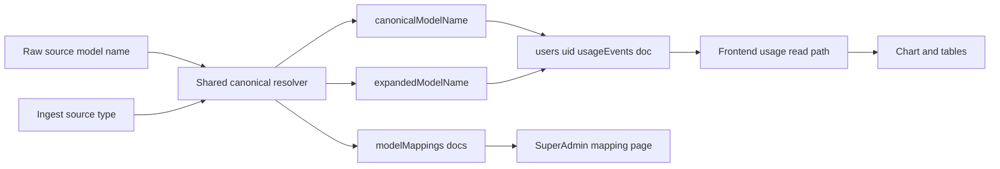

# Canonical Model Mapping and Admin Visibility Plan

## Decisions Locked

- Source of truth: **code-based mapping file** synced to Firestore.
- UI visibility: **super-admin only** (not org-admin sidebar).
- In-app editing: **no** (read-only view only).
- Mapping coverage: **every ingest source** must resolve to the same canonical model namespace.

## Target Architecture

## 1) Introduce Shared Mapping Module (single resolver)

- Add a shared module for canonicalization + alias tracking, e.g.:
  - `[/Users/glennsmith/coding/aicoder/shared/src/lib/modelMapping.ts](/Users/glennsmith/coding/aicoder/shared/src/lib/modelMapping.ts)`
- Include:
  - `canonicalizeModelName(rawName, source)`
  - `toDisplayModelName(canonicalName)`
  - static alias table grouped by provider/source with explicit source keys:
    - `cursor_csv`
    - `ccusage_daily_json`
    - `anthropic_usage_api`
    - `anthropic_code_api`
    - `openai_api`
    - `github_copilot_api`
    - `gemini_api`
    - `codeium_api`
- Keep existing `expandedModelName` untouched as source-detail label.

## 2) Persist Mapping Reflection in Firestore (read-only)

- Add/update function to sync mapping table from code into Firestore docs (idempotent upsert), e.g. in:
  - `[/Users/glennsmith/coding/aicoder/functions/src/usage/](/Users/glennsmith/coding/aicoder/functions/src/usage/)`
- Proposed collection shape:
  - `modelMappings/{canonicalModelId}`
  - fields:
    - `canonicalName`
    - `displayName`
    - `aliasesBySource` (source-specific columns/fields):
      - `cursorCsvAliases[]`
      - `ccusageDailyJsonAliases[]`
      - `anthropicUsageApiAliases[]`
      - `anthropicCodeApiAliases[]`
      - `openaiApiAliases[]`
      - `githubCopilotApiAliases[]`
      - `geminiApiAliases[]`
      - `codeiumApiAliases[]`
    - `allAliases[]`
    - `sources[]`
    - `updatedAt`
    - `version`
- Trigger strategy:
  - callable/manual sync for now (safe and deterministic), optionally invoked during deploy/admin action.

## 3) Replace Fragmented Normalization in Ingest + Read Paths

- Replace local regex normalizers with shared resolver in all currently supported ingest/read paths:
  - `[/Users/glennsmith/coding/aicoder/functions/src/usage/ingestUsageEventsFromCursorCsv.ts](/Users/glennsmith/coding/aicoder/functions/src/usage/ingestUsageEventsFromCursorCsv.ts)`
  - `[/Users/glennsmith/coding/aicoder/functions/src/usage/ingestUsageEventsFromCcusageDailyJson.ts](/Users/glennsmith/coding/aicoder/functions/src/usage/ingestUsageEventsFromCcusageDailyJson.ts)`
  - `[/Users/glennsmith/coding/aicoder/frontend/src/lib/usageEvents.ts](/Users/glennsmith/coding/aicoder/frontend/src/lib/usageEvents.ts)`
  - `[/Users/glennsmith/coding/aicoder/frontend/src/lib/orgUsageEvents.ts](/Users/glennsmith/coding/aicoder/frontend/src/lib/orgUsageEvents.ts)`
  - `[/Users/glennsmith/coding/aicoder/frontend/src/components/CSVDragDrop.tsx](/Users/glennsmith/coding/aicoder/frontend/src/components/CSVDragDrop.tsx)`
  - `[/Users/glennsmith/coding/aicoder/frontend/src/lib/ccusageJson.ts](/Users/glennsmith/coding/aicoder/frontend/src/lib/ccusageJson.ts)`
- Ensure source tagging is preserved end-to-end so mapping lookup is source-aware for CSV, JSON, and API-ingested rows.
- Ensure writes always keep:
  - `model.name` = canonical
  - `model.expandedName` and `raw.expandedModelNames[]` = source detail

## 4) Stabilize Dedupe/Matching for Time-Series Continuity

- Keep current strengthened dedupe key semantics (include expanded + breakdown dimensions) and align all ingestion fingerprints with canonical `model.name` + expanded raw for detail.
- Verify no cross-source overwrite by validating:
  - same timestamp + canonical model but different expanded variant remain distinct where intended
  - true duplicates are skipped (no excess writes)

## 5) Add Super-Admin Read-only Mapping Tab

- Add a new page/component (read-only) and wire into super-admin area:
  - `[/Users/glennsmith/coding/aicoder/frontend/src/pages/AdminPage.tsx](/Users/glennsmith/coding/aicoder/frontend/src/pages/AdminPage.tsx)`
  - new component, e.g. `[/Users/glennsmith/coding/aicoder/frontend/src/components/260210_0000_ModelMappingViewer.tsx](/Users/glennsmith/coding/aicoder/frontend/src/components/260210_0000_ModelMappingViewer.tsx)`
- Show:
  - canonical name
  - display name
  - aliases by source (one visible column/section per source key)
  - last synced/version metadata
- No edit controls.

## 6) Rules and Access

- Update Firestore security rules for read-only mapping access (super-admin policy only), likely in:
  - `[/Users/glennsmith/coding/aicoder/firestore.rules](/Users/glennsmith/coding/aicoder/firestore.rules)`
- Keep writes server-only via Functions/Admin SDK.

## 7) Backfill and Validation

- Add one-time backfill function/script to normalize older `usageEvents` docs and repopulate missing mapping metadata where safe.
- Validation checklist:
  - import Cursor CSV with `-high-thinking` variants
  - import ccusage JSON with provider-specific names
  - verify API-ingested rows from each supported connector map into the same canonical namespace
  - reload page and confirm `Group by expanded model` stays stable
  - confirm canonical grouping merges expected aliases
  - confirm no write explosion on reimport (duplicates mostly skipped)

## 8) Testing and Rollout

- Unit tests for mapping resolver edge cases (alias conflicts, unknown models, date-suffixed variants).
- Integration smoke test for both ingest callables.
- Deploy updated functions in `europe-west2` and verify sync + read-only UI.

## Notes on File Naming Rule

- Any new files created will use timestamp-prefixed names per repo rule (e.g. `YYMMDD_HHMM_...`).

